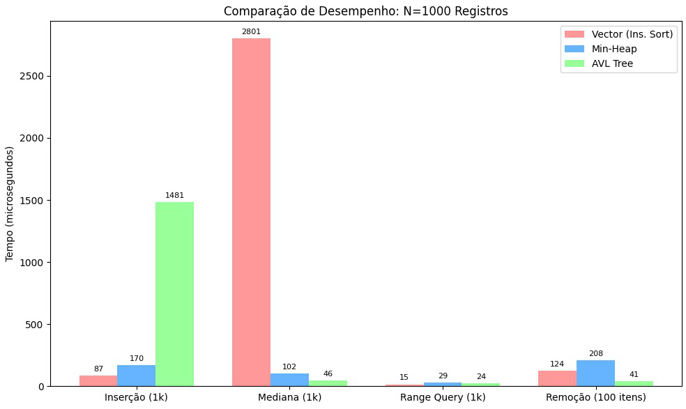
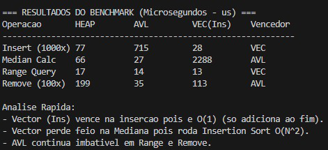

# Análise de Estruturas de Dados para Sensores de Temperatura

**Universidade Federal do Rio de Janeiro (UFRJ)** **Curso:** Engenharia de Controle e Automação  
**Disciplina:** Linguagens de Programação  
**Autores:** [Inserir Nomes dos Integrantes Aqui]  

---

## 1. Introdução e Motivação

Este projeto foi desenvolvido para atender à demanda de uma empresa de automação industrial que necessita otimizar o processamento de dados de sensores de temperatura. O sistema legado, baseado em listas e ordenação simples (*Insertion Sort*), não apresenta escalabilidade adequada para o volume crescente de sensores (centenas ou milhares), resultando em lentidão nas consultas e na tomada de decisão em tempo real.

O objetivo deste trabalho é implementar, comparar e analisar duas abordagens principais:
1.  **Abordagem Básica:** Vetor com *Insertion Sort* (Ordenação por Inserção).
2.  **Abordagem Aprimorada:** Uso de estruturas baseadas em árvores (**Min-Heap** e **Árvore AVL**).

## 2. Fundamentação Teórica (Análise Assintótica)

A escolha da estrutura de dados impacta diretamente o desempenho do sistema. Abaixo apresentamos a comparação teórica da complexidade de tempo (Big-O) para as operações críticas do sistema.

| Operação | Vetor (Insertion Sort) | Min-Heap | Árvore AVL | Justificativa |
| :--- | :---: | :---: | :---: | :--- |
| **Inserção** | $O(1)^*$ | $O(\log N)$ | $O(\log N)$ | AVL requer rebalanceamento (rotações); Heap apenas *sift-up*. O Vetor insere no final em $O(1)$, mas deixa o custo para a leitura. |
| **Busca (Search)** | $O(N)$ | $O(N)$ | $O(\log N)$ | AVL é uma árvore de busca binária balanceada. Heap não garante ordem lateral (apenas vertical). |
| **Remoção** | $O(N)$ | $O(N)$ (busca) + $O(\log N)$ | $O(\log N)$ | Remover do vetor exige deslocar elementos. Heap exige busca linear prévia para achar o elemento. |
| **Mínimo (Min)** | $O(N)$ ou $O(1)$** | $O(1)$ | $O(\log N)$ | A raiz da Min-Heap é sempre o menor elemento. Na AVL, basta percorrer à esquerda. |
| **Range Query** | $O(N)$ | $O(N)$ | $O(\log N + K)$ | A AVL permite descartar subárvores inteiras que não estão no intervalo. |
| **Ordenação** | $O(N^2)$ | $O(N \log N)$ | $O(N)$ (In-order) | Insertion Sort é quadrático (gargalo crítico). AVL já mantém ordem implícita. |

*\*Nota 1: Na nossa implementação do Vetor, a inserção é O(1) (append), mas o custo é pago na ordenação O(N²) quando a leitura ordenada é solicitada (Lazy Evaluation).*
*\*\*Nota 2: No vetor não ordenado, achar o mínimo exige varrer tudo ($O(N)$).*

## 3. Metodologia

Para validar a teoria, foram desenvolvidos scripts em C++ que realizam operações de *benchmark* (medição de tempo de alta precisão em microssegundos) em um conjunto de dados controlado.

### 3.1. Geração de Dados
Utilizou-se o algoritmo *Mersenne Twister* (`std::mt19937`) no arquivo `gerardados.cpp` para gerar **1000 leituras** de temperatura simuladas, variando entre -10.0°C e 45.0°C, salvas no arquivo `temperaturas.csv`.

### 3.2. Estruturas Implementadas
* **VectorInsertionSort (`insetionsort.cpp`):** Utiliza `std::vector` e aplica o algoritmo de ordenação por inserção apenas quando necessário.
* **PureMinHeap (`heaptree.cpp`):** Implementação de uma Heap Binária de Mínimo, otimizada para acesso rápido ao menor valor (`min`).
* **AVLTree (`AVLtree.cpp`):** Árvore Binária de Busca auto-balanceada, garantindo altura logarítmica para buscas e consultas por intervalo (*range queries*) estáveis.

## 4. Análise Experimental e Resultados

Os testes foram executados utilizando o script `benchmark.cpp`, que submete as três estruturas às mesmas operações sequencialmente.

### 4.1. Desempenho Geral (Comparativo)
Abaixo, o gráfico/tabela comparativa dos tempos de execução para Inserção, Busca de Mínimo, Range Query e Remoção.



**Análise dos Resultados:**
1.  **Inserção:** O Vetor é extremamente rápido para inserir pois apenas adiciona ao final, enquanto Heap e AVL gastam tempo organizando a estrutura.
2.  **Busca e Range Query:** A AVL demonstra superioridade absoluta. Enquanto o Vetor precisa varrer todos os dados ($O(N)$), a AVL filtra os dados pela estrutura da árvore ($O(\log N)$).
3.  **Ordenação/Print:** O *Insertion Sort* do vetor se mostrou ineficiente para grandes volumes de dados, confirmando a complexidade quadrática, enquanto a Heap e AVL conseguem extrair dados ordenados de forma muito mais célere.

### 4.2. Evidência de Execução
Exemplo de saída do programa `benchmark.cpp` mostrando a vitória da AVL em operações de busca complexas e da Heap em operações de mínimo.



## 5. Estrutura do Código e Arquivos

O projeto está organizado da seguinte forma:

| Arquivo | Descrição |
| :--- | :--- |
| `gerardados.cpp` | Cria o dataset sintético `temperaturas.csv` com 1000 registros aleatórios. |
| `benchmark.cpp` | **Script Principal.** Instancia as três estruturas, executa as operações e compara os tempos. |
| `temperaturas.csv` | Arquivo de dados gerado (Input). |
| `vector_benchmark.cpp` | Implementação da classe `VectorInsertionSort` usada no benchmark. |
| `heap_benchmark.cpp` | Implementação da classe `PureMinHeap` usada no benchmark. |
| `avl_benchmark.cpp` | Implementação da classe `AVLTree` usada no benchmark. |
| `insetionsort.cpp` | Aplicação *standalone* para rodar apenas a versão Vetor. |
| `heaptree.cpp` | Aplicação *standalone* para rodar apenas a versão Heap. |
| `AVLtree.cpp` | Aplicação *standalone* para rodar apenas a versão AVL. |

## 6. Como Executar

Para compilar e rodar o projeto, certifique-se de ter um compilador C++ (g++ ou clang) instalado.

**Passo 1: Gerar os dados**
```bash
g++ gerardados.cpp -o gerar
./gerar
# Isso criará o arquivo temperaturas.csv
